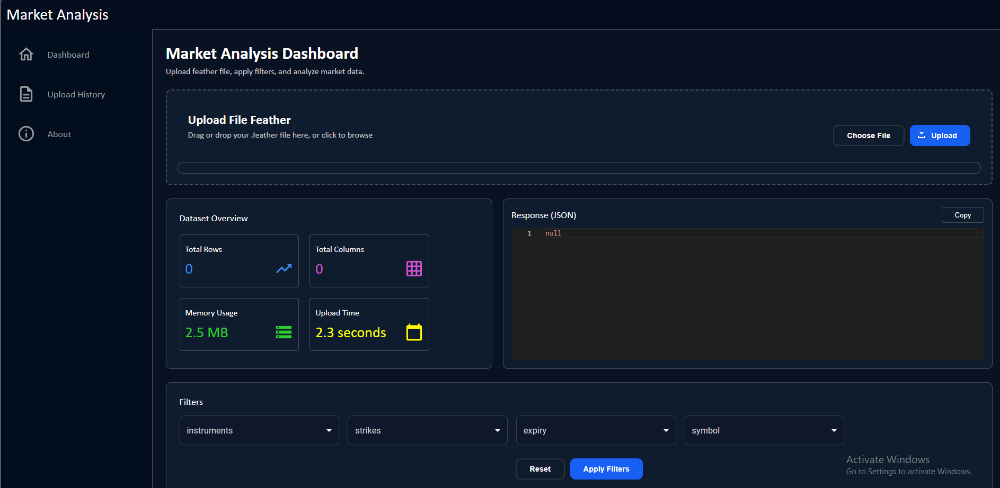
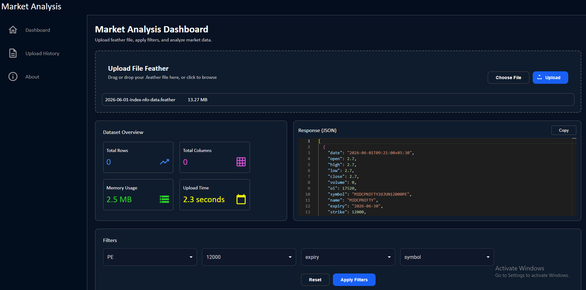
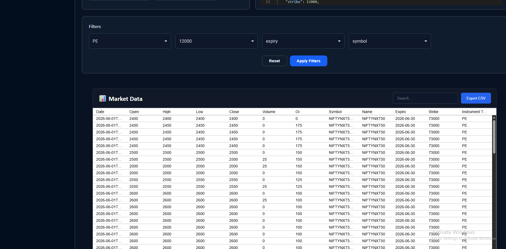

# Market Data Explorer

A full-stack web application that allows users to upload a market data **Feather (.feather)** file, explore futures and options contracts, view contract metadata, and filter records interactively.

---

## Features

* Upload Feather (.feather) files
* Validate uploaded file format
* Display total record count
* View uploaded market data
* Display unique expiries
* Display unique strikes
* Display available instrument types (CE, PE, FUT)
* Filter data by:

  * Instrument Type
  * Expiry
  * Strike
* RESTful API built with FastAPI
* React-based frontend

---

## Tech Stack

### Frontend

* React (Vite)
* Material UI
* Axios

### Backend

* FastAPI
* Pandas
* PyArrow

### Data Format

* Feather (.feather)

---

# Project Structure

```
Market-Data-Explorer/
│
├── backend/
│   ├── analysis.py
│   ├── newfile.py
│   ├── uploads/
│   └── requirements.txt
│
├── frontend/
│   └── marketAnalysis/
│       ├── src/
│       ├── public/
│       └── package.json
│
└── README.md
```

---

# Architecture

```
React Frontend
       │
       ▼
FastAPI Backend
       │
       ▼
Pandas + PyArrow
       │
       ▼
Feather Dataset
```

---

# API Endpoints

## Upload File

```
POST /upload
```

Uploads a Feather file and returns the total number of records.

---

## Get Metadata

```
GET /metadata
```

Returns:

* Unique Expiries
* Unique Strikes
* Available Instruments

---

## Filter Data

```
POST /filter
```

Example Request

```json
{
  "instrument": "CE",
  "expiry": "2026-06-30",
  "strike": 69900
}
```

---

# Setup Instructions

## Backend

Create a virtual environment

```
python -m venv .venv
```

Activate it

Windows

```
.venv\Scripts\activate
```

Install dependencies

```
pip install -r requirements.txt
```

Run FastAPI

```
uvicorn newfile:app --reload
```

Backend URL

```
http://localhost:8000
```

---

## Frontend

Go to frontend directory

```
cd frontend/marketAnalysis
```

Install packages

```
npm install
```

Run development server

```
npm run dev
```

Frontend URL

```
http://localhost:5173
```

---

# Assumptions

* Uploaded file is a valid Feather (.feather) file.
* Dataset contains columns such as:

  * date
  * expiry
  * strike
  * instrument_type
* Expiry and Strike values are extracted from the uploaded dataset.
* Filtering is performed on the uploaded dataset currently loaded by the application.
* The application is designed for a single active uploaded dataset.

---

# What I Already Knew

* Python
* REST API concepts
* React fundamentals
* Java and Spring Boot
* Basic data handling with Pandas

---

# What I Learned

* Feather file format
* PyArrow
* Reading analytical datasets using Pandas
* FastAPI file upload handling
* Metadata extraction from market datasets
* Building filtering APIs for financial data

---

# Challenges Faced

* Understanding the structure of the Feather dataset.
* Learning how to process Feather files using Pandas and PyArrow.
* Designing flexible filtering logic for multiple optional filters.
* Understanding that Futures, Call Options, and Put Options may have different expiry dates.

---

# Future Improvements

* Pagination on the backend
* Server-side sorting
* Column search
* Docker support
* Unit testing
* User authentication
* Deployment on cloud platforms
* Better error handling and logging

---

# Screenshots

## Home Page




---

## Upload File



---

## Tabel Panel



---

# Author

**Tanishq**

Project completed as part of a Software Developer technical assignment.
